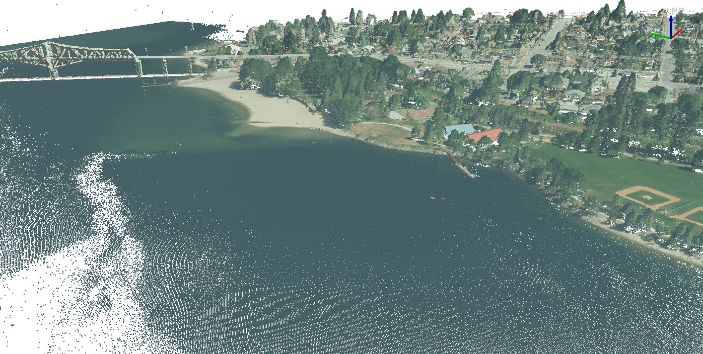

# LiDAR Working Group - Quick PDAL demo
https://pdal.io/en/stable/index.html

## Download source data here:

[Point Cloud](https://nrs.objectstore.gov.bc.ca/gdwuts/082/082f/2017/pointcloud/bc_082f054_2_1_1_xyes_8_utm11_180827.laz)

[Ortho](https://nrs.objectstore.gov.bc.ca/gdwuts/082/082f/2017/pointcloud/bc_082f054_2_1_1_xc150mm_utm11_2017.tif)

PDAL is accessable from the OSGEO shell... or see [Conda Quickstart](https://pdal.io/en/stable/quickstart.html)

Below are some quick examples of pipelines you can use with the json included in this repo. PDAL has lots of other functionality to explore and can be used with python using pdal-python.

## Pipeline: colourize point cloud

 `pdal pipeline pdal-colourize.json`
---

## Pipeline: simple dtm

`pdal pipeline pdal-dtm.json`

## Pipeline: simple dsm

`pdal pipeline pdal-dsm.json`

## GDAL is Magic
`gdal_calc -A dsm.tif -B dtm.tif --calc="A-B" --extent intersect  --outfile chm.tif`

